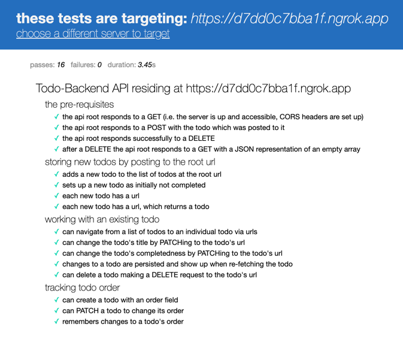

# Microhttp Todo Backend

This is an implementation of [https://todobackend.com/](https://todobackend.com/) written using

* [microhttp](https://github.com/ebarlas/microhttp)
* [sqlite](sqlite.org)

Along with a few small helper libraries.

## Testing

To run the server against the api specs:

``` 
./mvnw clean compile jlink:jlink
./target/maven-jlink/classifiers/image/bin/server
```

Then forward the server using something like [ngrok](https://ngrok.com/)

```
ngrok http 7777
```

And run the tests [here](https://todobackend.com/specs/index.html) on the forwarded url.

## Feedback

There is some repetition in the code and a few things that aren't maximally efficient. The goals
here were to showcase usage of microhttp in a "real" scenario and to show a bit of what the world
is like without annotations, databind, or other such magic.

With that context, feedback is welcome. Make an issue with what you think should be different or
you think is suboptimal.

